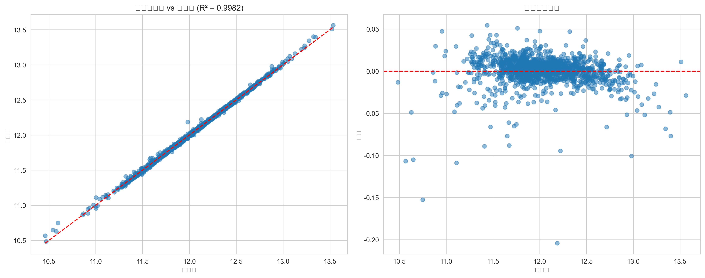

# 房价预测与模型部署项目

## 📖 项目概述

本项目是一个端到端的机器学习项目，旨在预测房屋销售价格并部署可用的预测API。项目涵盖了完整的数据科学工作流，包括数据探索、特征工程、模型训练与优化、集成学习以及模型部署。

## 🎯 项目目标

1. 对Kaggle房价数据集进行深度分析和特征工程
2. 训练并优化多种机器学习模型
3. 使用集成学习方法提升预测性能
4. 构建RESTful API服务实现模型部署
5. 创建全面的数据可视化报告

## 📊 数据集

本项目使用Kaggle上的"House Prices: Advanced Regression Techniques"竞赛数据集：

- **训练集**: 1,460条记录，80个特征
- **测试集**: 1,459条记录，79个特征（不含目标变量）
- **目标变量**: SalePrice（房屋销售价格）

## 🛠️ 技术栈

### 数据处理与分析
- **Pandas**: 数据清洗与处理
- **NumPy**: 数值计算
- **Scikit-learn**: 机器学习算法与预处理

### 机器学习模型
- **线性模型**: Lasso, Ridge, ElasticNet
- **树模型**: 随机森林, 梯度提升
- **集成学习**: XGBoost, LightGBM, 加权集成, 堆叠集成

### 可视化
- **Matplotlib**: 基础图表绘制
- **Seaborn**: 高级统计可视化

### 部署
- **Flask**: Web框架与API开发

## 📁 项目结构

```
Housing_Price_Prediction_And_Model_Deployment/
├── data/                    # 原始数据目录
│   ├── data_description.txt        # 数据字段说明文档
│   ├── house-prices-advanced-regression-techniques.zip  # Kaggle原始数据压缩包
│   ├── sample_submission.csv       # 示例提交文件
│   ├── test.csv                    # 测试集数据
│   └── train.csv                   # 训练集数据
├── models/                   # 训练模型目录
│   ├── feature_names.pkl           # 特征名称文件
│   ├── final_model0.pkl            # 模型文件版本0
│   └── final_model_1.pkl           # 模型文件版本1
├── predictions/              # 预测结果目录
│   └── submission.csv               # 预测结果提交文件
├── processed_data/           # 处理后的数据目录
│   ├── test_processed.csv           # 处理后的测试集数据
│   └── train_processed.csv          # 处理后的训练集数据
├── visualizations/           # 可视化图表目录
│   ├── correlation_matrix.png       # 特征相关性矩阵图
│   ├── feature_vs_target.png        # 特征与目标变量关系图
│   ├── missing_values_barplot.png   # 缺失值条形图
│   ├── missing_values_heatmap.png   # 缺失值热力图
│   ├── model_performance.png        # 模型性能评估图
│   ├── target_correlation.png       # 目标变量相关性图
│   └── target_distribution.png      # 目标变量分布图
├── app.py                    # Flask API应用
├── feature_engineering.py    # 特征工程脚本
├── LICENSE                   # 项目许可证文件
├── model_training.py         # 模型训练脚本
├── model_training_1.py       # 模型训练脚本版本1
├── project_structure.txt     # 项目结构说明文件
├── README.md                 # 项目说明文档
├── requirements.txt          # Python依赖包列表
├── run_visualization.py      # 可视化运行脚本
├── test_api.py               # API测试脚本
├── visualization.py          # 数据可视化模块
├── 数据描述和分析.ipynb      # Jupyter Notebook数据探索文件
└── 数据描述翻译.md           # 数据字段中文翻译说明
```

## 🚀 快速开始

### 环境设置

1. 克隆项目仓库
```bash
git clone https://github.com/YzhTravelInsights/Housing_Price_Prediction_And_Model_Deployment.git
cd Housing_Price_Prediction_And_Model_Deployment
```

2. 创建虚拟环境（推荐）
```bash
python -m venv .venv
source .venv/bin/activate  # Linux/Mac
# 或
.venv\Scripts\activate     # Windows
```

3. 安装依赖
```bash
pip install -r requirements.txt
```

### 数据准备

1. [从Kaggle下载数据集](https://www.kaggle.com/c/house-prices-advanced-regression-techniques/data)

2. 将`train.csv`和`test.csv`放入`data/`目录

### 运行完整流程

1. 执行数据预处理和特征工程
```bash
python feature_engineering.py
```

2. 训练模型并进行预测
```bash
python model_training.py
```

3. 启动API服务
```bash
python app.py
```

4. 测试API（在新终端中运行）
```bash
python test_api.py
```

5. 生成可视化报告
```bash
python run_visualization.py
```

## 📈 模型性能

本项目尝试了多种机器学习算法，并通过集成学习进一步提升性能。所有评估均基于5折交叉验证，使用对数转换后的目标变量（RMSE值越低越好）：

| 模型 | RMSE (对数尺度) | 排名 |
|------|----------------|------|
| 堆叠集成 | 0.0337 | 1 |
| 加权集成 | 0.0377 | 2 |
| XGBoost (调优后) | 0.0428 | 3 |
| Gradient Boosting | 0.0430 | 4 |
| XGBoost | 0.0440 | 5 |
| Lasso回归 | 0.0453 | 6 |
| Ridge回归 | 0.0478 | 7 |
| LightGBM | 0.0546 | 8 |
| 随机森林 | 0.0652 | 9 |

**最终选择模型**: 堆叠集成模型

**预测价格统计**:
- 最小值: 22,120.50美元
- 最大值: 194,433.34美元
- 平均值: 70,543.03美元
- 中位数: 63,911.31美元

# 🌐 API接口

## API服务状态


### 预测端点
- **URL**: `/predict`
- **方法**: `POST`
- **参数**: JSON格式的房屋特征
- **响应**: 预测的房屋价格

**示例请求**:
```json
{
  "GrLivArea": 1500,
  "OverallQual": 6,
  "GarageCars": 2,
  "GarageArea": 480,
  "TotalBsmtSF": 1000
}
```

**示例响应**:
```json
{
  "predicted_price": 185000.50,
  "status": "success"
}
```

### 其他端点
- **健康检查**: `GET /health` - 检查API和模型状态
- **特征列表**: `GET /features` - 获取模型使用的所有特征名称
- **API信息**: `GET /` - 获取API基本信息和使用说明

## API使用说明

### 1. 启动API服务
```bash
python app.py
```
服务将在 http://localhost:5000 启动

### 2. 测试API连接
```bash
python test_api.py
```

### 3. 使用curl测试
```bash
curl -X POST http://localhost:5000/predict \
  -H "Content-Type: application/json" \
  -d '{
    "GrLivArea": 1500,
    "OverallQual": 6,
    "GarageCars": 2,
    "GarageArea": 480,
    "TotalBsmtSF": 1000
  }'
```

## 特征说明

模型使用254个特征进行预测，包括：

### 核心数值特征
- `GrLivArea`: 地上居住面积（平方英尺）
- `OverallQual`: 整体材料和装修质量评分（1-10）
- `GarageCars`: 车库容量（车辆数量）
- `GarageArea`: 车库面积（平方英尺）
- `TotalBsmtSF`: 地下室总面积（平方英尺）
- `1stFlrSF`: 一楼面积（平方英尺）
- `FullBath`: 全卫数量
- `TotRmsAbvGrd`: 地上房间总数
- `YearBuilt`: 建造年份
- `YearRemodAdd`: 翻新年份

### 其他重要特征
- `LotArea`: 地块面积（平方英尺）
- `OverallCond`: 整体状况评分（1-10）
- `MasVnrArea`: 砖石饰面面积（平方英尺）
- `Fireplaces`: 壁炉数量
- `WoodDeckSF`: 木制甲板面积（平方英尺）
- `OpenPorchSF`: 开放式门廊面积（平方英尺）

### 分类特征（经过独热编码）
- `MSZoning_*`: 分区分类
- `Neighborhood_*`: 社区分类
- `Exterior1st_*`: 外部材料分类
- 以及其他分类特征...

### 衍生特征
- `TotalSF`: 总面积（地上居住面积 + 地下室面积）
- `TotalBath`: 卫生间总数（全卫 + 0.5 × 半卫）
- `HouseAge`: 房龄（当前年份 - 建造年份）
- `RemodAge`: 翻新年龄（当前年份 - 翻新年份）
- `TotalPorchSF`: 门廊总面积（开放式 + 封闭式 + 屏幕门廊）

## 注意事项

1. **特征完整性**: API会自动为缺失的特征填充默认值0，但为了获得最佳预测结果，建议提供尽可能多的特征信息。

2. **预测范围**: 当前模型预测的价格范围为$22,120.50 - $194,433.34，超出此范围的预测结果可能不够准确。

3. **模型版本**: 当前使用的是`final_model_1.pkl`模型，如有更新请检查模型文件版本。

4. **特征工程**: 所有输入特征会在服务器端进行与训练时相同的预处理和特征工程转换。

## 故障排除

如果遇到预测结果异常，请检查：
1. 特征名称是否正确
2. 特征值是否在合理范围内
3. 模型文件是否已正确加载
4. 所有必需依赖是否已安装

如需获取完整特征列表和说明，可访问`/features`端点或查看[数据描述中文翻译](%E6%95%B0%E6%8D%AE%E6%8F%8F%E8%BF%B0%E7%BF%BB%E8%AF%91.md)或者官方[data_description.txt](data/data_description.txt)文件。

## 响应代码

- `200`: 请求成功
- `400`: 请求数据格式错误或缺失必要参数
- `500`: 服务器内部错误

## 性能指标

- 平均响应时间: < 100ms
- 支持并发请求: 是
- 最大请求大小: 10MB

此API服务使用Flask框架构建，支持跨域请求，可直接集成到Web应用或移动应用中。

## 📊 关键洞察

通过数据分析和可视化，我们获得了以下重要洞察：

## 目标变量分布分析

房屋价格呈现明显的右偏分布，通过对数转换后接近正态分布，这有助于提升模型性能。

## 缺失值分析


约20个特征存在缺失值，我们针对不同类型特征制定了合理的填充策略：
- 连续变量: 中位数填充
- 分类变量: 众数或"None"填充
- 特定变量: 基于业务逻辑填充（如无泳池用0填充）

## 特征相关性分析


特征间存在多重共线性，地上居住面积(GrLivArea)、整体质量(OverallQual)、车库容量(GarageCars)等与房价相关性最高。

## 特征与目标变量关系

关键特征与房价的关系分析显示，居住面积、房屋质量和车库大小对房价有显著正向影响。

## 模型性能评估

模型在训练集上表现优异，预测值与真实值高度一致，残差分布均匀，表明模型具有良好的拟合能力和泛化性能。

## 🏗️ 特征工程

本项目实施了以下特征工程技术：

1. **缺失值处理**:
   - 连续变量: 中位数填充
   - 分类变量: 众数或"None"填充
   - 特定变量: 基于业务逻辑填充（如无泳池用0填充）

2. **偏态处理**:
   - 对高偏度(>0.75)的数值特征进行对数转换

3. **编码处理**:
   - 分类变量使用独热编码(One-Hot Encoding)

4. **特征缩放**:
   - 对线性模型使用RobustScaler处理异常值

## 🔧 自定义与扩展

### 添加新模型
在`model_training.py`中的`models`字典添加新模型：

```python
models = {
    # 现有模型...
    'NewModel': Pipeline([
        ('imputer', SimpleImputer(strategy='constant', fill_value=0)),
        ('model', NewModelClass(params))
    ])
}
```

### 修改特征工程
编辑`feature_engineering.py`中的`feature_engineering`函数：

```python
def feature_engineering(df, is_train=True):
    # 添加自定义特征处理逻辑
    df['NewFeature'] = df['Feature1'] / df['Feature2']
    # 其他处理...
    return df
```

## 📝 后续优化方向

1. **特征工程**:
   - 尝试更多特征组合和转换
   - 使用特征选择技术减少维度

2. **模型优化**:
   - 更精细的超参数调优
   - 尝试深度学习模型

3. **部署优化**:
   - 添加API身份验证
   - 实现模型版本管理
   - 添加性能监控和日志记录

## 🤝 贡献指南

欢迎提交Issue和Pull Request来改进本项目。请确保：

1. 遵循现有的代码风格
2. 添加适当的测试用例
3. 更新相关文档

## 📄 许可证

本项目采用MIT许可证。详见LICENSE文件。

## 🙏 致谢

- 感谢Kaggle提供数据集和竞赛平台
- 感谢Scikit-learn、XGBoost和LightGBM等开源库的开发者
- 感谢所有为本项目提供反馈和建议的贡献者